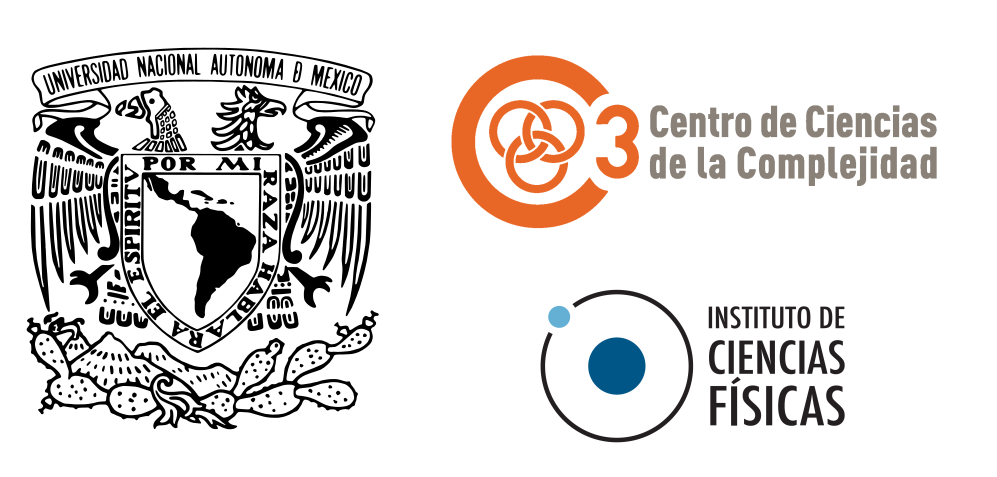

# CollectiveDynamics.jl

A Julia language package of different models of collective motion of self-propelled particles and the theoretical study of their emergent properties and the dynamical effects of different kinds of interactions and environments.

## Included Collective Motion Models

### Simple Vicsek Model
Implementation of the Simple Vicsek Model within periodic boundaries condition introduced in *Vicsek, T., Czirók, A., Ben-Jacob, E., Cohen, I. & Shochet, O. Novel type of phase transition in a system of self-driven particles. Phys. Rev. Lett. 75, 1226–1229 (1995). DOI 10.1103/physrevlett.75.1226.* in 2D and 3D

#### Usage

Add module with `using CollectiveDynamics.SVM2D` for the 2D version and `using CollectiveDynamics.SVM3D` for the 3D version.

The scripts `vicsek_2D_simulation.jl` and `vicsek_3D_simulation.jl` in the `Examples` folder shows an example of using the module. Both scripts receive command line arguments, run them as: `julia vicsek_2D_simulation.jl N rho eta T rep`

* N: Number of particles
* rho: Density
* eta: Noise Intensity
* T:      10^T iterations
* rep:    Ensemble index

The script will create a folder `art_DATA/SVM_2D` or `art_DATA/SVM_3D` and a folder structure within in the home directory were the files `pos_rep.dat` and `vels_rep.dat` with the positions and velocities of the particles will be saved. Both files are in binary format.

### Behavioural Rules Model
Implementation of the Behavioural Rules Model introduced in *Couzin, I.D., Krause, J., James, R., Ruxton, G.D. & Franks, N.R., (2002) Collective memory and spatial sorting in animal groups. Journal of Theoretical Biology 218, 1-11.*

#### Usage

Add module with `using CollectiveDynamics.BehaviouralRules`

The script `behavioural_rules_simulation.jl` in the `Examples` folder shows an example of using the module. The script can be run in parallel and receives command line arguments, run it as: `julia -p np behavioural_rules_simulation.jl N zoo zoa T rep init`

* np: Number of processors
* N: Number of particles
* zoo: Size of the orientation zone relative to system size
* zoa: Size of the attraction zone relative to system size
* T:      10^T iterations
* rep:    Ensemble index
* init: Initialization scheme, if `init = R` then Random Initial Conditions if `init = A` Random Initial Positions but aligned orientations.

The script will create a folder `art_DATA/BEHAV_R_01_N_015` for the random initial conditions simulations and `art_DATA/"BEHAV_R_01_N_015_AL` for simulations starting from an ordered state and a folder structure within in the home directory were the files `pos_rep.dat` and `vels_rep.dat` with the positions and velocities of the particles will be saved. Both files are in binary format.

### Extended Inertial Spin Model
Implementation of the Inertial Spin Model introduced in *Cavagna, A. et al. Flocking and turning: a new model for self-organized collective motion. J. Stat. Phys. 158, 601–627 (2014). DOI 10.1007/s10955-014-1119-3.* extended with long-range interactions.

#### Usage

Add module with `using CollectiveDynamics.InertialSpin`

The scripts `inertial_spin_simulation.jl` and `inertial_spin_long_range_simulation.jl` in the `Examples` folder show examples of using the module. The scripts receive command line arguments, run them as: `julia inertial_spin_simulation.jl N eta T tau rep` or `julia inertial_spin_long_range_simulation.jl N eta T n_nl tau rep`

* N: Number of particles
* eta: Dissipation term
* T: Temperature or noise
* n_nl: Average number of long-range interactions per particle
* tau: 10^tau iterations
* rep:    Ensemble index

The script will create a folder `art_DATA/INERTIAL_SPIN` or `art_DATA/EXTENDED_INERTIAL_SPIN` and a folder structure within in the home directory were the files `pos_rep.dat` and `vels_rep.dat` with the positions and velocities of the particles will be saved. Both files are in binary format.

### Collective Motion Model with Short and Long-range Interactions
A Collective Motion Model based on short and long-range alignment interactions between particles in open space. Short-range interactions can be defined either metric or topologically.

#### Usage

Add module with `using CollectiveDynamics.ShortLongRange`

The scripts `SLR_metric_simulation.jl` and `SLR_top_simulation.jl` in the `Examples` folder show examples of using the module for the case of metric or topological short-range interactions. The scripts can be run in parallel and receive command line arguments, run them as: `julia -p np SLR_metric_simulation.jl N kappa omega eta Ti Tf rep` or `julia -p np SLR_top_simulation.jl N kappa omega eta Ti Tf rep`

* np: Number of processors
* N: Number of particles
* kappa: Average long-range interactions per particle
* omega: Relative weight between short and long-range interactions in the system
* eta: Noise Intensity
* Ti: Start iterations at 10^Ti
* Tf: End iterations at 10^Tf
* rep: Ensemble index

The script will create a folder `art_DATA/SLR_MET` or `art_DATA/SLR_TOP` and a folder structure within in the home directory were the files `pos_rep.dat` and `vels_rep.dat` with the positions and velocities of the particles will be saved. Both files are in binary format.

---

### M.C Martin Zumaya
### Centro de Ciencias de la Complejidad, UNAM
### Instituto de Ciencas Físicas, UNAM
